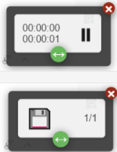

# EasyListen


**EasyListen** 是一个轻量级且用户友好的 Chrome 扩展程序，通过本地或远程 OpenAI TTS（文本转语音）API 标准将文本转换为自然声音。它使用户能够聆听网页内容、学习语言、辅助阅读或将此体验提供给有阅读障碍的人。

- 🌐 **支持多种语言** （英语和中文）  
- 🎙️ **多种语音选项** 以获得个性化体验  
- ⚙️ **自定义设置** 包括速度、格式和 API 端点  

## 功能

- **文本转语音转换**：将网页文本或用户输入的文本转换为高质量音频。
- **多语言支持** ：界面提供英语和中文，可通过设置进行更多语言定制。
- **选择语音** ：从多种声音中选择（例如 Xiaoxiao、Yunjian 等），并具有预览功能。
- **自定义设置** ：
  - 调整播放速度 (-100% 到 +100%)。
  - 设置文本分割长度以处理大量文本。
  - 配置音频输出格式 (MP3、WAV、AAC、OGG)。
  - 定制 API 端点和密钥以使用本地或远程 TTS 服务。
- **浮动用户界面** ：交互式播放控制，包括播放/暂停、下载和进度跟踪。
- **浅色/深色主题切换** ：在舒适的用户体验之间进行切换。
- **错误处理** ：提供友好的通知以解决缺少音频或无效 API 设置等问题。
- **无障碍性** ：通过提供听觉替代方案来帮助有阅读困难的用户。

## 安装

### 0.部署 edge-tts 服务(选择远程提供商请跳过)

edge-tts-webui 依赖后端 TTS 服务，以下是部署步骤：

#### 拉取镜像

```bash
docker pull travisvn/openai-edge-tts:latest
```

#### 运行服务

```bash
docker run -d -p 5050:5050 \
    --name open-edge-tts \
    --restart always \
    --network openwebui-network \
    -e API_KEY=b4297f4c-5795-4427-ad51-049e5c1ad215 \
    -e PORT=5050 \
    -e DEFAULT_VOICE=zh-CN-YunjianNeural \
    -e DEFAULT_RESPONSE_FORMAT=mp3 \
    -e DEFAULT_SPEED=1.0 \
    -e DEFAULT_LANGUAGE=zh_CN \
    -e REQUIRE_API_KEY=True \
    -e REMOVE_FILTER=False \
    -e EXPAND_API=True \
    travisvn/openai-edge-tts:latest
```

- 说明：
  - API_KEY：用于认证请求
  - PORT：服务监听端口，默认 5050。
  - --network：可选，若有自定义网络可指定。

### 1 从 Chrome 网上应用店安装（即将上线）

1. 访问 [Chrome 网上应用店] （添加链接待发布）。
2. 搜索 "EasyListen"。
3. 点击 **添加到 Chrome** 并确认安装。

### 2 手动安装（开发者模式）

1. 克隆或下载此仓库：

   ```bash
   git clone git@github.com:pangzheng/EasyListen.git
   ```

2. 打开 Chrome 并导航至 `chrome://extensions/`。
3. 启用 **开发者模式** （右上角切换）。
4. 点击 **加载未打包扩展程序** ，选择包含扩展文件的文件夹。
5. EasyListen 扩展程序现在应出现在您的 Chrome 工具栏中。
   
## 使用

1. **打开扩展程序**：
   - 单击 Chrome 标栏中的 EasyListen 图标以打开弹出窗口。
   - 弹出窗口显示当前活动网页的内容或允许手动输入文本。
2. **生成音频** ：
   - 单击 **听** 按钮将显示的文本转换为语音。
   - 浮动用户界面将出现，包含播放控制（播放/暂停、播放/总时长、下载和分片加载进度）。
3. **自定义设置** ：
   - 在弹出窗口中单击 **设置** 按钮以打开选项页面。
   - 调整声音、播放速度、输出格式、文本分割长度、并发和 API 设置。
   - 预览声音在保存更改之前进行调整(暂时静态)。
4. **切换语言/主题** ：
   - 使用 **语言** 按钮在英语和中文之间切换。
   - 使用 **主题** 按钮在浅色模式和深色模式之间切换。
5. **下载音频** ：
   - 一旦所有音频分片生成完毕，使用浮动用户界面上的下载按钮保存设置的音频格式文件。
 
## 屏幕截图

| 弹出窗口界面 | 选项页面 | 浮动播放用户界面 |
|--------------|----------|------------------|
|  |  |  |


## 配置

### API 设置

EasyListen 支持与 OpenAI TTS 标准兼容的自定义 API 端点。要进行配置：

1. 转到 **设置** 页面
2. 输入您的 **API URL**
   - 对于本地部署，以 [edge-tts](https://github.com/rany2/edge-tts)为例，可以是 `http://localhost/v1/audio/speech`
   - 对于使用 OPENAI TTS 服务商，请参考[OPENAI Create speech](https://platform.openai.com/docs/api-reference/audio/createSpeech)
   - 本插件兼容所有遵循 openai TTS API 标准的 TTS 服务
3. 获得的 **API 密钥** 
    - 远程提供您从 TTS 服务提供商
    - 本地, 以 `edge-tts` 为例，启动服务时配置的 "API_KEY" 环境变量
4. 保存设置以应用更改。
   
### 默认设置

以下设置以 `edge-tts` 服务为参考

- **声音** ：zh-CN-YunjianNeural
- **格式** ：MP3
- **速度** ：0%（正常速度）
- **分割长度** ：200 个字符
- **并发数** ：1
- **API URL** ：`http://localhost/v1/audio/speech`
- **API 密钥** ：(服务配置文件)
  
## 开发

### 先决条件

- **Chrome 浏览器** （版本 88 或更高）
- **Node.js**（可选，用于构建或测试）
- **Git** 用于版本控制
- **TTS 服务** 用于提供文字转换

### 项目结构

```
easylisten/
├── _locales/               # Chrome 扩展程序清单本地化文件
│   ├── en/messages.json
│   └── zh/messages.json
├── css/                    
│   ├── common.css          # 抽象共享样式
│   ├── content.css         # 浮窗 UI 样式
│   ├── options.css         # 设置样式
│   ├── popup.css           # 插件首页样式
│   └── theme.css           # 抽象样式
├── example/                # 语音预览音频文件
├── icons/                  # 扩展图标
├── js/                     
│   ├── audio.js            # TTS 处理脚本
│   ├── content.js          # 浮窗脚本
│   ├── i18n.js             # 国际化脚本
│   ├── options.js          # 设置脚本
│   ├── ui.js               # 首页脚本
│   └── utils.js            # 抽象共享脚本
├── manifest.json           # Chrome 扩展程序清单
├── options.html            # 设置页面
├── popup.html              # 主弹出窗口界面
├── README_EN.md            # 英文项目说明文件
└── README.md               # 此文件
```

### 构建扩展程序

1. 克隆仓库：

   ```bash
   git clone git@github.com:pangzheng/EasyListen.git
   ```

2. 如需进行更改（例如，添加新声音或功能），请修改代码。
3. 使用 `chrome://extensions/` 中的 **加载未打包扩展程序** 选项加载扩展程序。
   
### 在本地运行

- 确保运行了本地 TTS 服务器（如果使用自定义 API）。
- 更新设置中的 **API URL** 和 **API 密钥** 指向您的服务器。
- 加载扩展程序并在 HTTP/HTTPS 页面上测试功能。
  
## 贡献

我们欢迎对 EasyListen 进行改进的贡献！要进行贡献：

1. 分支库。
2. 创建新分支 (`git checkout -b feature/your-feature`)。
3. 修改代码并提交 (`git commit -m "Add your feature"`))。
4. 推送到您的分支 (`git push origin feature/your-feature`)。
5. 打开包含详细更改说明的拉取请求 (Pull Request) 。
请确保您的代码遵循现有样式并包括适当的测试。

## 问题

如果您遇到错误或有功能请求，请在 [GitHub Issues 页面](https://github.com/your-username/easylisten/issues) 上打开 issue。尽可能提供详细信息，包括：

- 重现该问题的步骤
- 预期与实际行为之间的差异
- 屏幕截图或日志（如果适用）

## 许可证

本项目采用 [MIT License](LICENSE) 授权。请参阅 LICENSE 文件以获取详细信息。

## 致谢

- 兼容 OpenAI TTS API （[文档链接](https://platform.openai.com/docs/overview)）。
- [edge-tts-webui](https://github.com/ycyy/edge-tts-webui)。
- [edge-tts](https://github.com/rany2/edge-tts)
- 感谢所有贡献者和支持者的支持！

---
## 自定义说明

1. **仓库 URL** ：请将 `your-username` 替换为您实际的 GitHub 用户名以更新克隆链接和 issue 链接。
2. **屏幕截图** ：创建一个 `screenshots/` 文件夹，并添加弹出窗口、选项页面和浮动用户界面的图片。在 README 中更新正确的路径。
3. **Chrome 网上应用店链接** ：一旦发布扩展程序，请添加链接。
4. **许可证文件** ：确保仓库中存在一个包含 MIT 许可证文本的 `LICENSE` 文件。
5. **其他功能** ：如果您计划添加更多功能（例如，新声音、云存储集成），请相应地更新 **功能** 部分。
如有需要，请告知您需要帮助的具体部分或进一步细化其他文件（如 `LICENSE`），或其他改进内容