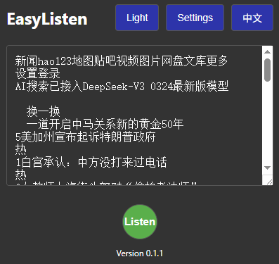
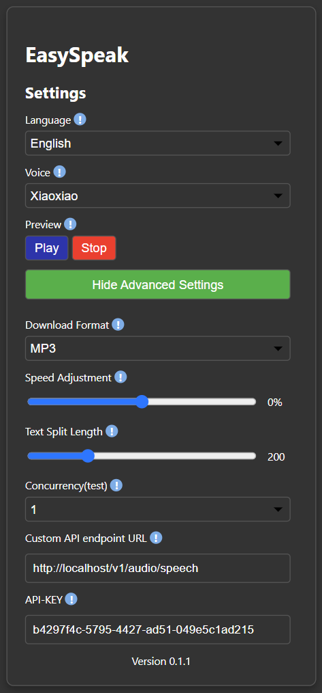
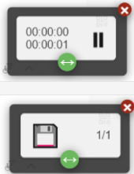

# EasyListen


**EasyListen** is a lightweight and user-friendly Chrome extension that converts text into natural speech through local or remote OpenAI TTS (Text-to-Speech) API standards. It enables users to listen to web content, learn languages, assist in reading, or provide this experience for those with reading disabilities.

- 🌐 **Supports multiple languages** (English and Chinese)
- 🎙️ **Multiple voice options** for personalized experiences
- ⚙️ **Custom settings** including speed, format, and API endpoint

## Features

- **Text-to-Speech Conversion**: Converts web text or user-input text into high-quality audio.
- **Multilingual Support**: Interface provides English and Chinese; more languages can be customized through settings.
- **Voice Selection**: Choose from multiple voices (e.g., Xiaoxiao, Yunjian etc.) with preview functionality.
- **Custom Settings**:
  - Adjust playback speed (-100% to +100%).
  - Set text segment length to handle large amounts of text.
  - Configure audio output format (MP3, WAV, AAC, OGG).
  - Customize API endpoint and key to use local or remote TTS services.
- **Floating User Interface**: Interactive playback controls including play/pause, download, and progress tracking.
- **Light/Dark Theme Switching**: Switch between comfortable user experiences.
- **Error Handling**: Provide friendly notifications for issues such as missing audio or invalid API settings.
- **Accessibility**: Offer auditory alternatives to assist users with reading difficulties.

## Installation

### 0. Deploy edge-tts service (Skip if using remote provider)

edge-tts-webui relies on a backend TTS service, here are the deployment steps:

#### Pull Image

```bash
docker pull travisvn/openai-edge-tts:latest
```

#### Run Service

```bash
docker run -d -p 5050:5050 \
    --name open-edge-tts \
    --restart always \
    --network openwebui-network \
    -e API_KEY=b4297f4c-5795-4427-ad51-049e5c1ad215 \
    -e PORT=5050 \
    -e DEFAULT_VOICE=zh-CN-YunjianNeural \
    -e DEFAULT_RESPONSE_FORMAT=mp3 \
    -e DEFAULT_SPEED=1.0 \
    -e DEFAULT_LANGUAGE=zh_CN \
    -e REQUIRE_API_KEY=True \
    -e REMOVE_FILTER=False \
    -e EXPAND_API=True \
    travisvn/openai-edge-tts:latest
```

- Note:
  - API_KEY: Used for request authentication.
  - PORT: Service listens on port, default is 5050.
  - --network: Optional, specify if a custom network exists.

### 1. Install from Chrome Web Store (Coming soon)

1. Visit [Chrome Web Store] (Add link when published).
2. Search for "EasyListen".
3. Click **Add to Chrome** and confirm installation.

### 2. Manual Installation (Developer Mode)

1. Clone or download the repository:
   
   ```bash
   git clone git@github.com:pangzheng/EasyListen.git
   ```
   
2. Open Chrome and navigate to `chrome://extensions/`.
3. Enable **Developer mode** (toggle in the top right corner).
4. Click on **Load unpacked**, select the folder containing the extension files.
5. The EasyListen extension should now appear on your Chrome toolbar.

## Usage

1. **Open Extension**:
   - Click on the EasyListen icon in the Chrome toolbar to open the popup window.
   - The popup window displays content from the current active web page or allows manual text input.
2. **Generate Audio** :
   - Click the **Listen** button to convert displayed text into speech.
   - A floating user interface will appear with playback controls (play/pause, play/total duration, download and segment loading progress).
3. **Custom Settings** :
   - Click on the **Settings** button in the popup window to open the options page.
   - Adjust voice, playback speed, output format, text segment length, concurrency, and API settings.
   - Preview the sound before saving changes (currently static).
4. **Switch Language/Theme** :
   - Use the **Language** button to switch between English and Chinese.
   - Use the **Theme** button to switch between light mode and dark mode.
5. **Download Audio** :
   - Once all audio segments are generated, use the download button in the floating user interface to save the audio file in the desired format.

## Screenshots

| Popup Window Interface | Options Page | Floating Playback UI |
|------------------------|--------------|----------------------|
|  |  |  |

## Configuration

### API Settings

EasyListen supports custom API endpoints that are compatible with the OpenAI TTS standard. To configure:

1. Go to the **Settings** page.
2. Enter your **API URL**
   - For local deployment, for example `edge-tts` can be used as `http://localhost/v1/audio/speech`.
   - For using OPENAI TTS provider, refer to [OPENAI Create speech](https://platform.openai.com/docs/api-reference/audio/createSpeech).
   - This plugin is compatible with all TTS services that follow the OpenAI TTS API standard.
3. Obtain your **API Key**
    - Remote: Obtain from TTS service providers.
    - Local, for example in `edge-tts`, it is the "API_KEY" environment variable set when starting the service.
4. Save settings to apply changes.

### Default Settings

Settings referenced from `edge-tts`:
- **Voice**: zh-CN-YunjianNeural
- **Format**: MP3
- **Speed**: 0% (normal speed)
- **Segment Length**: 200 characters
- **Concurrency**: 1
- **API URL**: `http://localhost/v1/audio/speech`
- **API Key**: (configured in the service configuration file)

## Development

### Prerequisites

- **Chrome Browser** (version 88 or higher)
- **Node.js** (optional, for building or testing)
- **Git** for version control
- **TTS Service** to provide text-to-speech conversion.

### Project Structure

```
easylisten/
├── _locales/               # Chrome extension localization files
│   ├── en/messages.json
│   └── zh/messages.json
├── css/                    
│   ├── common.css          # Abstract shared styles
│   ├── content.css         # Pop-up UI styles
│   ├── options.css         # Settings page styles
│   ├── popup.css           # Extension home page styles
│   └── theme.css           # Abstract styles
├── example/                # Speech preview audio files
├── icons/                  # Extension icons
├── js/                     
│   ├── audio.js            # TTS processing scripts
│   ├── content.js          # Pop-up scripts
│   ├── i18n.js             # Internationalization scripts
│   ├── options.js          # Settings scripts
│   ├── ui.js               # Home page scripts
│   └── utils.js            # Abstract shared scripts
├── manifest.json           # Chrome extension manifest file
├── options.html            # Settings page
├── popup.html              # Main pop-up window interface
├── README_EN.md            # English project documentation file
└── README.md               # This document
```

### Building the Extension

1. Clone the repository:
   ```bash
   git clone git@github.com:pangzheng/EasyListen.git
   ```
2. If you make changes (e.g., add new voices or features), modify the code.
3. Load the extension using **Load unpacked** in `chrome://extensions/`.

### Running Locally

- Ensure that the local TTS server is running (if using a custom API).
- Update the settings with your **API URL** and **API Key** to point to your server.
- Load the extension and test its functionality on HTTP/HTTPS pages.

## Contributing
We welcome contributions to improve EasyListen! To contribute:
1. Fork the repository.
2. Create a new branch (`git checkout -b feature/your-feature`).
3. Modify code and commit (`git commit -m "Add your feature"`).
4. Push changes to your branch (`git push origin feature/your-feature`).
5. Open a pull request (PR) with detailed change descriptions.
Please ensure your code follows existing styles and includes appropriate tests.

## Issues

If you encounter issues or have feature requests, open an issue on the [GitHub Issues page](https://github.com/your-username/easylisten/issues). Provide as much detail as possible:
- Steps to reproduce the issue
- Differences between expected and actual behavior
- Screenshots or logs (if applicable)

## License

This project is licensed under the [MIT License](LICENSE). See the LICENSE file for details.

## Acknowledgements

- Compatible with OpenAI TTS API ([documentation link](https://platform.openai.com/docs/overview)).
- [edge-tts-webui](https://github.com/ycyy/edge-tts-webui).
- [edge-tts](https://github.com/rany2/edge-tts)
- Thank you to all contributors and supporters!
---
## Custom Instructions

1. **Repository URL**: Replace `your-username` with your actual GitHub username in the clone link and issue links.
2. **Screenshots**: Create a `screenshots/` folder, add screenshots of the pop-up window, options page, and floating user interface. Update the correct paths in the README.
3. **Chrome Web Store Link**: Add the link once the extension is published.
4. **License File**: Ensure that there exists a `LICENSE` file containing MIT License text within the repository.
5. **Additional Features**: If you plan to add more features (e.g., new voices, cloud storage integration), update the **Features** section accordingly.
Please inform us if specific parts require assistance or further refinement of other files such as `LICENSE`, etc.